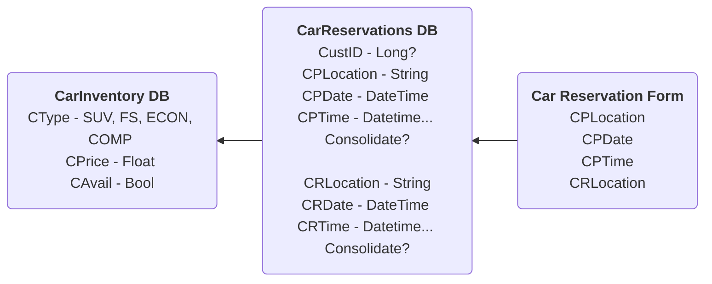

# CST438_CarRental_Team5

Project outline and requirements (Springboot, REST, JPA, etc)

  

API’s with versioning

  

Problem tracking Tracing/logging

  

Failure, recovery, and security features

  

Junit tests

  

Video link

   
<B>Databse UML</B> 

    

